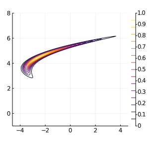
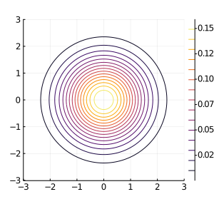
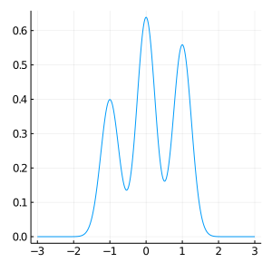
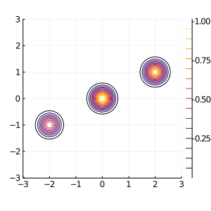
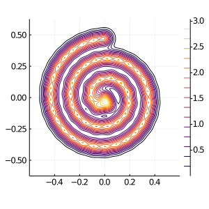
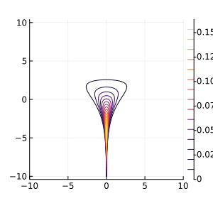
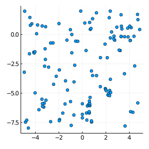
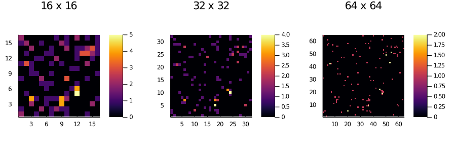

# MCMCLogDensityProblems.jl: Vectorised Log Density Targets for MCMC

This package contains common target distributions in Bayesian inference, with vectorised log-density and gradient evaluation supported.

## A minimal example

```julia
target = Banana()               # the banana distribution

x = randn(dim(target))          # size(x) is (2,)
@info logpdf(target, x)         # -433.1
@info logpdf_grad(target, x)    # (-433.1, [646.1, 129.8])

x = hcat(x, x)                  # size(x) is (2, 2)
@info logpdf(target, x)         # [-433.1, -433.1]
@info logpdf_grad(target, x)    # ([-433.1, -433.1], [646.1 646.1; 129.8 129.8])
```

## A note on the gradient interface

All targets support `logpdf_grad(target, x::VecOrMat)`, which returns a tuple of log-densities and their gradients.
The gradient in most cases (if I didn't hand-code them) is computed via ReverseDiff.jl, which compiles a tape for the gradient.
Thus, if you were to call the gradient multiple times, you can potentially save the compilation time by avoiding calling `logpdf_grad` directly, but instead
```julia
gradfunc = gen_logpdf_grad(target, x)
gradfunc(x) # 1st time
gradfunc(x) # 2nd time
            # ...
```
Also note that `gen_logpdf_grad` still expects the second argument `x::Union{AbstractVector, AbstractMatrix}` to correctly dispatch on vectorised mode or not.

## Targets included

- Banana distribution: `Banana()`
  
  

- Multivariate diagonal Gaussian: `HighDimGaussian(dim)`
  
  

- Mixture of Gaussians 

  - One dimensional mixture of gaussians: `OneDimGaussianMixtures()`

  

  - Two dimensional mixture of gaussians: `TwoDimGaussianMixtures()`

  

- Spiral distribution: `Spiral(n_gaussians, σ)`
  
  

- Neal's funnel: `Funnel()`

  

- Logistic regression on the [German credit dataset](https://archive.ics.uci.edu/ml/datasets/statlog+(german+credit+data))
- Log-Gaussian Cox point process on the [Finnish pine saplings dataset](https://rdrr.io/cran/spatstat.data/man/finpines.html)
  - Dataset raw
    
    
  - Dataset processed
    
    
  Note that the visualisations above are not the posterior but rather just datasets.

